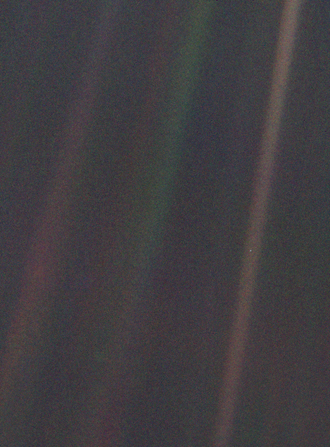
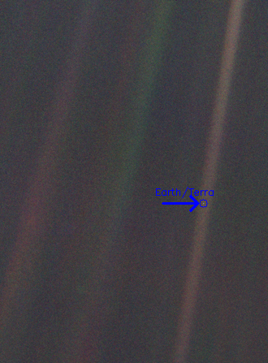

# RDF5714 - Kinematics of the Pale Blue Dot / Cinemática do Pálido Ponto Azul

**Context**: Materials for the Graduate Program in Rehabilitation and Functional Performance (PPG-RDF) at the University of São Paulo (USP).
**Contexto**: Materiais para o Programa de Pós-Graduação em Reabilitação e Desempenho Funcional (PPG-RDF) da Universidade de São Paulo (USP).

**Instructor / Instrutor**: Prof. Dr. Paulo Roberto Pereira Santiago (EEFERP-USP).

## Project Overview / Visão Geral do Projeto

This repository contains a Python script designed to detect "Earth" from an image using HSV (Hue, Saturation, Value) color segmentation. It demonstrates fundamental concepts of biomechanical image analysis.
Este repositório contém um script Python projetado para detectar a "Terra" em uma imagem usando segmentação de cores HSV (Matiz, Saturação, Valor). Ele demonstra conceitos fundamentais de análise biomecânica de imagens.

> "Vista a seis bilhões de quilômetros, a Terra é um minúsculo ponto (a mancha azulada-branca que se encontra aproximadamente no meio da faixa marrom) perdida na vastidão do espaço profundo."

## Technical Details: BGR to HSV Transformation / Detalhes Técnicos: Transformação BGR para HSV

In biomechanical image analysis and computer vision, robust color detection is crucial. The default color space in OpenCV is BGR (Blue-Green-Red). However, BGR is sensitive to lighting conditions.
Na análise biomecânica de imagens e visão computacional, a detecção robusta de cores é crucial. O espaço de cores padrão no OpenCV é BGR (Azul-Verde-Vermelho). No entanto, o BGR é sensível às condições de iluminação.

We convert images to the **HSV (Hue, Saturation, Value)** color space because:
Nós convertemos imagens para o espaço de cores **HSV (Matiz, Saturação, Valor)** porque:

- **Hue (H) / Matiz**: Represents the color type (e.g., Red, Blue, Green). / Representa o tipo de cor (ex: Vermelho, Azul, Verde).
- **Saturation (S) / Saturação**: Represents the vibrancy of the color. / Representa a vivacidade da cor.
- **Value (V) / Valor**: Represents the brightness. / Representa o brilho.

By separating the chromatic component (Hue) from intensity (Value), we can create masks that are robust to shadows and lighting variations.
Ao separar o componente cromático (Matiz) da intensidade (Valor), podemos criar máscaras que são robustas a sombras e variações de iluminação.

## Installation and Usage / Instalação e Uso

1.  **Environment Setup / Configuração do Ambiente**:
    Ensure you have `uv` installed. / Certifique-se de ter o `uv` instalado.

    ```bash
    uv venv
    source .venv/bin/activate
    uv pip install -r requirements.txt
    ```

2.  **Running the Script / Executando o Script**:

    The script will automatically check for the input image. If `pale_blue_dot.png` is missing, it will create a synthetic one for testing.
    O script verificará automaticamente a imagem de entrada. Se `pale_blue_dot.png` estiver faltando, ele criará uma sintética para teste.

    ```bash
    python find_earth.py
    ```

3.  **Output / Saída**:

    ### Original Image / Imagem Original

    

    ### Result / Resultado
    - `earth_highlighted.png`: Image with Earth highlighted. / Imagem com a Terra destacada.

    
    - `earth_coordinates.csv`: CSV file containing the coordinates. / Arquivo CSV contendo as coordenadas.

## Requirements / Requisitos

- Python 3.12+
- opencv-python
- numpy
- pandas
- openpyxl
